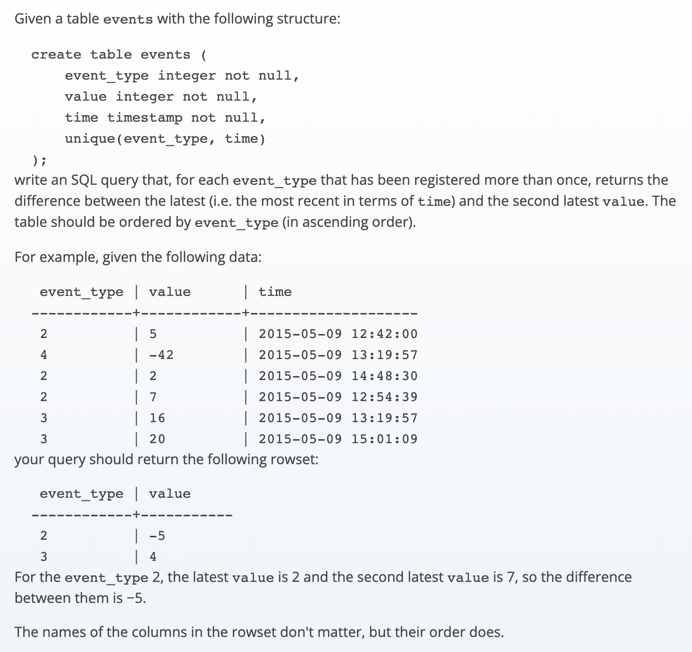

# 题目
[sql_events_delta](https://app.codility.com/programmers/trainings/6/sql_events_delta/)



# 思路
1. 使用窗口函数取分区内的第一条、第二条数据，进而计算差值；

# solution

## firstvalue lead

```sql
select 
    distinct event_type,
    FIRST_VALUE(value) over (partition by event_type order by time desc) as value
from (
    select 
    event_type, 
    (FIRST_VALUE(value) over (partition by event_type order by time desc)	- LEAD(value) over (partition by event_type order by time desc)) as value,
    time
    from events
    
) t_type_diff
where value is not null
order by event_type asc;
```