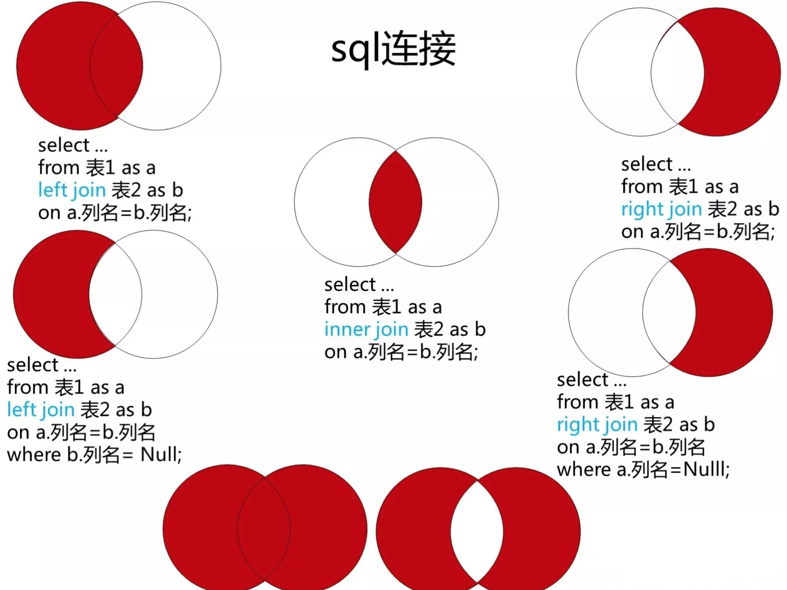

# 题目
[175. 组合两个表](https://leetcode.cn/problems/combine-two-tables/)

# 考察点
1. 左连、右连
2. 空处理



# 代码
```sql
SELECT p.firstName,p.lastName,a.city,ifnull(a.state,null) AS state
FROM Person p
LEFT JOIN Address a
ON (p.personId = a.personId);
```